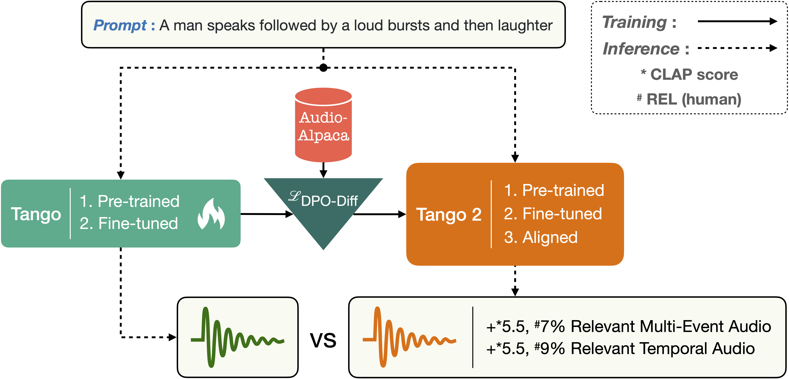

# Tango: LLM-guided Diffusion-based Text-to-Audio Generation and DPO-based Alignment

<p align="center">
      
      
[Tango 2 Paper](https://arxiv.org/abs/2404.09956) | [Tango 2 Model](https://huggingface.co/declare-lab/tango2) | [Tango 2 Demo](https://huggingface.co/spaces/declare-lab/tango2)  | [Tango 2 Replicate Demo](https://replicate.com/declare-lab/tango) | [Audio-Alpaca](https://huggingface.co/datasets/declare-lab/audio-alpaca) | [Tango 2 Website](https://tango2-web.github.io/)  
[Tango Paper](https://arxiv.org/pdf/2304.13731.pdf) | [Tango Model](https://huggingface.co/declare-lab/tango) | [Tango Demo](https://huggingface.co/spaces/declare-lab/tango) | [Tango Website](https://tango-web.github.io/) 

</p>

🎵 🔥 🎉 🎉 As part of our collaboration with NVIDIA, we are releasing two new checkpoints. The method and results are reported [here](https://arxiv.org/pdf/2406.15487). The performance for text-to-music especially improved significantly than its predecessors. Access the new version of Tango [here](https://huggingface.co/declare-lab/tango-af-ac-ft-ac). TangoMusic can be accessed [here](https://huggingface.co/declare-lab/tango-music-af-ft-mc). A big shoutout to our NVIDIA collaborators -- full credit to them.

🎵 🔥 🎉 🎉 We are releasing Tango 2 built upon Tango for text-to-audio generation. Tango 2 was initialized with the Tango-full-ft checkpoint and underwent alignment training using DPO on audio-alpaca, a pairwise text-to-audio preference dataset. [Download the model](https://huggingface.co/declare-lab/tango2), [Access the demo](https://huggingface.co/spaces/declare-lab/tango2). [Trainer is available in the tango2 directory](https://github.com/declare-lab/tango/tree/master/tango2)🎶

## Quickstart on Google Colab

| Colab | Info
| --- | --- |
[](https://colab.research.google.com/github/saravananbcs/tango-demo-colab/blob/master/Tango_2_Google_Colab_demo.ipynb) | [Tango_2_Google_Colab_demo.ipynb](https://github.com/declare-lab/tango/blob/master/Tango_Google_Colab_demo.ipynb)


## Tango Model Family

| Model Name                 | Model Path                                       |
|----------------------------|-------------------------------------------------|
| Tango                      | [https://huggingface.co/declare-lab/tango](https://huggingface.co/declare-lab/tango)                               |
| Tango-Full-FT-Audiocaps    | [https://huggingface.co/declare-lab/tango-full-ft-audiocaps](https://huggingface.co/declare-lab/tango-full-ft-audiocaps) |
Tango-Full-FT-Audio-Music-Caps | [https://huggingface.co/declare-lab/tango-full-ft-audio-music-caps](https://huggingface.co/declare-lab/tango-full-ft-audio-music-caps) |
| Mustango | [https://huggingface.co/declare-lab/mustango](https://huggingface.co/declare-lab/mustango) |
| Tango-Full | [https://huggingface.co/declare-lab/tango-full](https://huggingface.co/declare-lab/tango-full) |
| Tango-2    | [https://huggingface.co/declare-lab/tango2](https://huggingface.co/declare-lab/tango2)|
| Tango-2-full| [https://huggingface.co/declare-lab/tango2-full](https://huggingface.co/declare-lab/tango2-full)|
| Tango-AF-AC-FT-AC| [https://huggingface.co/declare-lab/tango-af-ac-ft-ac](https://huggingface.co/declare-lab/tango-af-ac-ft-ac)|
| TangoMusic-AF-FT-MC| [https://huggingface.co/declare-lab/tango-music-af-ft-mc](https://huggingface.co/declare-lab/tango-music-af-ft-mc)|

## Description

**TANGO** is a latent diffusion model (LDM) for text-to-audio (TTA) generation. **TANGO** can generate realistic audios including human sounds, animal sounds, natural and artificial sounds and sound effects from textual prompts. We use the frozen instruction-tuned LLM Flan-T5 as the text encoder and train a UNet based diffusion model for audio generation. We perform comparably to current state-of-the-art models for TTA across both objective and subjective metrics, despite training the LDM on a 63 times smaller dataset. We release our model, training, inference code, and pre-trained checkpoints for the research community.

<p align="center">
  
</p>

🎵 🔥 We are releasing Tango 2 built upon Tango for text-to-audio generation. Tango 2 was initialized with the Tango-full-ft checkpoint and underwent alignment training using DPO on audio-alpaca, a pairwise text-to-audio preference dataset. 🎶

<p align="center">
  
</p>

🎵 🔥 We are also making **Audio-alpaca** available. **Audio-alpaca** is a pairwise preference dataset containing about 15k (prompt,audio_w, audio_l) triplets where given a textual prompt, audio_w is the preferred generated audio and audio_l is the undesirable audio. [Download Audio-alpaca](https://huggingface.co/datasets/declare-lab/audio-alpaca). **Tango 2** was trained on **Audio-alpaca**.

## Quickstart Guide

Download the **TANGO** model and generate audio from a text prompt:

```python
import IPython
import soundfile as sf
from tango import Tango

tango = Tango("declare-lab/tango2")

prompt = "An audience cheering and clapping"
audio = tango.generate(prompt)
sf.write(f"{prompt}.wav", audio, samplerate=16000)
IPython.display.Audio(data=audio, rate=16000)
```
[CheerClap.webm](https://user-images.githubusercontent.com/13917097/233851915-e702524d-cd35-43f7-93e0-86ea579231a7.webm)

The model will be automatically downloaded and saved in cache. Subsequent runs will load the model directly from cache.

The `generate` function uses 100 steps by default to sample from the latent diffusion model. We recommend using 200 steps for generating better quality audios. This comes at the cost of increased run-time.

```python
prompt = "Rolling thunder with lightning strikes"
audio = tango.generate(prompt, steps=200)
IPython.display.Audio(data=audio, rate=16000)
```
[Thunder.webm](https://user-images.githubusercontent.com/13917097/233851929-90501e41-911d-453f-a00b-b215743365b4.webm)

<!-- [MachineClicking](https://user-images.githubusercontent.com/25340239/233857834-bfda52b4-4fcc-48de-b47a-6a6ddcb3671b.mp4 "sample 1") -->

Use the `generate_for_batch` function to generate multiple audio samples for a batch of text prompts:

```python
prompts = [
    "A car engine revving",
    "A dog barks and rustles with some clicking",
    "Water flowing and trickling"
]
audios = tango.generate_for_batch(prompts, samples=2)
```
This will generate two samples for each of the three text prompts.

More generated samples are shown [here](https://github.com/declare-lab/tango/blob/master/samples/README.md).

## Prerequisites

Our code is built on pytorch version 1.13.1+cu117. We mention `torch==1.13.1` in the requirements file but you might need to install a specific cuda version of torch depending on your GPU device type.

Install `requirements.txt`.

```bash
git clone https://github.com/declare-lab/tango/
cd tango
pip install -r requirements.txt
```

You might also need to install `libsndfile1` for soundfile to work properly in linux:

```bash
(sudo) apt-get install libsndfile1
```

## Datasets

Follow the instructions given in the [AudioCaps repository](https://github.com/cdjkim/audiocaps) for downloading the data. The audio locations and corresponding captions are provided in our `data` directory. The `*.json` files are used for training and evaluation. Once you have downloaded your version of the data you should be able to map it using the file ids to the file locations provided in our `data/*.json` files.

Note that we cannot distribute the data because of copyright issues.

🎵 🔥 We are also making **Audio-alpaca** available. **Audio-alpaca** is a pairwise preference dataset containing about 15k (prompt,audio_w, audio_l) triplets where given a textual prompt, audio_w is the preferred generated audio and audio_l is the undesirable audio. [Download Audio-alpaca](https://huggingface.co/datasets/declare-lab/audio-alpaca). **Tango 2** was trained on **Audio-alpaca**.

## How to train?
We use the `accelerate` package from Hugging Face for multi-gpu training. Run `accelerate config` from terminal and set up your run configuration by the answering the questions asked.

You can now train **TANGO** on the AudioCaps dataset using:

```bash
accelerate launch train.py \
--text_encoder_name="google/flan-t5-large" \
--scheduler_name="stabilityai/stable-diffusion-2-1" \
--unet_model_config="configs/diffusion_model_config.json" \
--freeze_text_encoder --augment --snr_gamma 5 \
```

The argument `--augment` uses augmented data for training as reported in our paper. We recommend training for at-least 40 epochs, which is the default in `train.py`.

To start training from our released checkpoint use the `--hf_model` argument.

```bash
accelerate launch train.py \
--hf_model "declare-lab/tango" \
--unet_model_config="configs/diffusion_model_config.json" \
--freeze_text_encoder --augment --snr_gamma 5 \
```

Check `train.py` and `train.sh` for the full list of arguments and how to use them.

The training script should automatically download the AudioLDM weights from [here](https://zenodo.org/record/7600541/files/audioldm-s-full?download=1). However if the download is slow or if you face any other issues then you can: i) download the `audioldm-s-full` file from [here](https://huggingface.co/haoheliu/AudioLDM-S-Full/tree/main), ii) rename it to `audioldm-s-full.ckpt`, and iii) keep it in `/home/user/.cache/audioldm/` direcrtory.

To train **TANGO 2** on the Audio-alpaca dataset from **TANGO** checkpoint using:
The training script will download audio_alpaca wav files and save it in {PATH_TO_DOWNLOAD_WAV_FILE}/audio_alpaca. Default location will be ~/.cache/huggingface/datasets.
```bash
accelerate launch  tango2/tango2-train.py --hf_model "declare-lab/tango-full-ft-audiocaps" \
--unet_model_config="configs/diffusion_model_config.json" \
--freeze_text_encoder  \
--learning_rate=9.6e-7 \
--num_train_epochs=5  \
--num_warmup_steps=200 \
--per_device_train_batch_size=4 \
--per_device_eval_batch_size=4  \
--gradient_accumulation_steps=4 \
--beta_dpo=2000  \
--sft_first_epochs=1 \
--dataset_dir={PATH_TO_DOWNLOAD_WAV_FILE}
```


## How to make inferences?

### From your trained checkpoints

Checkpoints from training will be saved in the `saved/*/` directory.

To perform audio generation and objective evaluation in AudioCaps test set from your trained checkpoint:

```bash
CUDA_VISIBLE_DEVICES=0 python inference.py \
--original_args="saved/*/summary.jsonl" \
--model="saved/*/best/pytorch_model_2.bin" \
```

Check `inference.py` and `inference.sh` for the full list of arguments and how to use them.

To perform audio generation and objective evaluation in AudioCaps test set for **TANGO 2** :

```bash
CUDA_VISIBLE_DEVICES=0 python tango2/inference.py \
--original_args="saved/*/summary.jsonl" \
--model="saved/*/best/pytorch_model_2.bin" \
```
Note that **TANGO 2** inference.py script is different from **TANGO** .

### From our released checkpoints in Hugging Face Hub

To perform audio generation and objective evaluation in AudioCaps test set from our huggingface checkpoints:

```bash
python inference_hf.py --checkpoint="declare-lab/tango"
```

### Note

We use functionalities from `audioldm_eval` for objective evalution in `inference.py`. It requires the gold reference audio files and generated audio files to have the same name. You need to create the directory `data/audiocaps_test_references/subset` and keep the reference audio files there. The files should have names as following: `output_0.wav`, `output_1.wav` and so on. The indices should correspond to the corresponding line indices in `data/test_audiocaps_subset.json`.

We use the term _subset_ as some data instances originally released in AudioCaps have since been removed from YouTube and are no longer available. We thus evaluated our models on all the instances which were available as of 8th April, 2023.

We use wandb to log training and infernce results.

## Experimental Results

### Tango

|           **Model**            |  **Datasets**  | **Text** | **#Params** |         FD ↓          |   KL ↓   |  FAD ↓   |         OVL ↑          |   REL ↑   |
|:------------------------------:|:--------------:|:--------:|:-----------:|:---------------------:|:--------:|:--------:|:----------------------:|:---------:|
|          Ground truth          |       −        |    −     |      −      |           −           |    −     |    −     |         91.61          |   86.78   |
|                                |                |          |             |                       |          |          |                        |           |
|           DiffSound            |     AS+AC      |    ✓     |    400M     |         47.68         |   2.52   |   7.75   |           −            |     −     |
|           AudioGen             | AS+AC+8 others |    ✗     |    285M     |           −           |   2.09   |   3.13   |           −            |     −     |
|           AudioLDM-S           |       AC       |    ✗     |    181M     |         29.48         |   1.97   |   2.43   |           −            |     −     |
|           AudioLDM-L           |       AC       |    ✗     |    739M     |         27.12         |   1.86   |   2.08   |           −            |     −     |
|                                |                |          |             |                       |          |          |                        |           |
| AudioLDM-M-Full-FT<sup>‡</sup> | AS+AC+2 others |    ✗     |    416M     |         26.12         | **1.26** |   2.57   |         79.85          |   76.84   |
|  AudioLDM-L-Full<sup>‡</sup>   | AS+AC+2 others |    ✗     |    739M     |         32.46         |   1.76   |   4.18   |         78.63          |   62.69   |
|       AudioLDM-L-Full-FT       | AS+AC+2 others |    ✗     |    739M     |       **23.31**       |   1.59   |   1.96   |           −            |     −     |
|                                |                |          |             |                       |          |          |                        |           |
|              TANGO             |       AC       |    ✓     |    866M     |         24.52         |   1.37   | **1.59** |       **85.94**        | **80.36** |

### Tango 2

| Model                | Parameters | FAD ↓     | KL ↓      | IS ↑      | CLAP ↑    | OVL ↑      | REL ↑      |
|----------------------|------------|-----------|-----------|-----------|-----------|------------|------------|
| AudioLDM-M-Full-FT   | 416M       | 2.57      | 1.26      | 8.34      | 0.43      | -          | -          |
| AudioLDM-L-Full      | 739M       | 4.18      | 1.76      | 7.76      | 0.43      | -          | -          |
| AudioLDM 2-Full      | 346M       | **2.18**  | 1.62      | 6.92      | 0.43      | -          | -          |
| AudioLDM 2-Full-Large| 712M       | **2.11**  | 1.54      | 8.29      | 0.44      | 3.56       | 3.19       |
| Tango-full-FT        | 866M       | 2.51      | 1.15      | 7.87      | 0.54      | 3.81       | 3.77       |
| Tango 2              | 866M       | 2.69      | **1.12**  | **9.09**  | **0.57**  | **3.99**   | **4.07**   |


## Citation
Please consider citing the following articles if you found our work useful:

```bibtex
@misc{majumder2024tango,
      title={Tango 2: Aligning Diffusion-based Text-to-Audio Generations through Direct Preference Optimization}, 
      author={Navonil Majumder and Chia-Yu Hung and Deepanway Ghosal and Wei-Ning Hsu and Rada Mihalcea and Soujanya Poria},
      year={2024},
      eprint={2404.09956},
      archivePrefix={arXiv},
      primaryClass={cs.SD}
}
@article{ghosal2023tango,
  title={Text-to-Audio Generation using Instruction Tuned LLM and Latent Diffusion Model},
  author={Ghosal, Deepanway and Majumder, Navonil and Mehrish, Ambuj and Poria, Soujanya},
  journal={arXiv preprint arXiv:2304.13731},
  year={2023}
}
```

## Acknowledgement
We borrow the code in `audioldm` and `audioldm_eval` from the [AudioLDM](https://github.com/haoheliu/AudioLDM) [repositories](https://github.com/haoheliu/audioldm_eval). We thank the AudioLDM team for open-sourcing their code.
