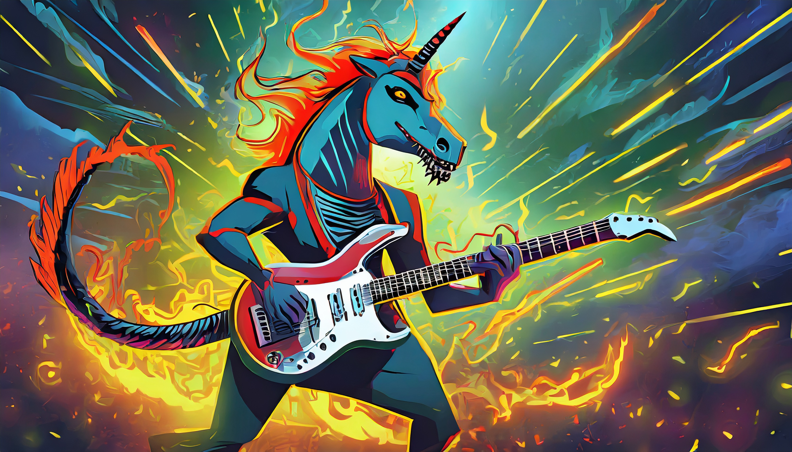

<div align="center">

# Mustango: Toward Controllable Text-to-Music Generation

[Demo](https://replicate.com/declare-lab/mustango) | [Model](https://huggingface.co/declare-lab/mustango) | [Website and Examples](https://amaai-lab.github.io/mustango/) | [Paper](https://arxiv.org/abs/2311.08355) | [Dataset](https://huggingface.co/datasets/amaai-lab/MusicBench)

[](https://huggingface.co/spaces/declare-lab/mustango)
</div>

Meet Mustango, an exciting addition to the vibrant landscape of Multimodal Large Language Models designed for controlled music generation. Mustango leverages the Latent Diffusion Model (LDM), Flan-T5 encoder of Tango with musical features to do the magic!

🔥 Live demo available on [Replicate](https://replicate.com/declare-lab/mustango) and [HuggingFace](https://huggingface.co/spaces/declare-lab/mustango).

<div align="center">
  
</div>


## Quickstart Guide

Generate music from a text prompt:

```python
import IPython
import soundfile as sf
from mustango import Mustango

model = Mustango("declare-lab/mustango")

prompt = "This is a new age piece. There is a flute playing the main melody with a lot of staccato notes. The rhythmic background consists of a medium tempo electronic drum beat with percussive elements all over the spectrum. There is a playful atmosphere to the piece. This piece can be used in the soundtrack of a children's TV show or an advertisement jingle."

music = model.generate(prompt)
sf.write(f"{prompt}.wav", audio, samplerate=16000)
IPython.display.Audio(data=audio, rate=16000)
```

## Installation

```bash
git clone https://github.com/declare-lab/tango
cd tango/mustango
pip install -r requirements.txt
cd diffusers
pip install -e .
```
